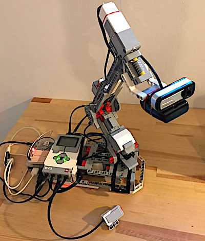

# jetcam
SkyWayとRaspberryPi(以下:ラズパイ)を利用したリモートカメラシステム。  
LEGOと連動して遠隔からカメラアームを旋回・上下・首振り操作。  
旅行中のペット見守りカメラとして開発。  





## Features
- WEBアプリを通して外出先から自宅のカメラにアクセス
- WEBアプリを途中退室、ブラウザを急に閉じても再度アクセス可能
- ログイン認証付きWEBアプリで安心・安全
- メッセージ入力により、LEDを点灯、消灯操作
- メッセージ入力により、カメラがあるラズパイ側のプログラムをシャットダウン可能
- WEBアプリを通して、カメラの付いたLEGOアームを操作可能
- LEGOアーム操作は、Pan(旋回)、Pedestal(高さ)、Tilt(上下首振り)の3種

## Requirement
- Webアプリ側(frontend): Nuxt.jsにて構築
- ラズパイ側(backend): Pythonにて構築
- LEGOアーム(カメラアーム): LEGO-EV3にてC言語でコンパイルしたファイルを実行

### ラズパイ
実行環境
- device:Raspberry Pi 3 Model B
- OS: Raspbian GNU/Linux 9 (stretch)
- python:3.5.3 
- camera: USBカメラ ELECOM UCAM-C0220FBBK
- Lチカ:LED、抵抗、ジャンパーコード、ブレッドボード

python3.5はすでにサポート終了しているので、上位バージョンをおすすめします。  

USBカメラに関しては、古いものや特殊なものを除いて一般的なUSBカメラであれば問題ないと思います。  

Lチカ環境はGPIOの21番ピンを使用。グラウンドとLEDの間には適切な抵抗を入れて下さい。  
[参考サイト:SkyWay WebRTC Gatewayハンズオン](https://qiita.com/nakakura/items/9d5fb1ff43c40c97c244)


### SkyWay
SkyWayを利用して、カメラ映像をストリーミングする  
  
NTTコミュニケーションズが提供する「ビデオ通話、音声通話をかんたんにアプリに実装できる、
マルチプラットフォームなSDK」  
[公式ページ](https://webrtc.ecl.ntt.com/)
  
**上記公式サイトに沿って設定し、APIKeyを取得する。(無料)**


#### WebRTC Gateway
SkyWayが提供するIOT端末用のSkyWayEngine

[公式解説](https://webrtc.ecl.ntt.com/documents/webrtc-gateway.html)

[GitHub](https://github.com/skyway/skyway-webrtc-gateway)

[API仕様書](http://35.200.46.204/)

**ラズパイで実行するため`gateway_linux_arm`をダウンロードする**  
[ダウンロード v0.3.2](https://github.com/SkyWay/SkyWay-webrtc-gateway/releases/tag/0.3.2)

### Firebase
[Firebase](https://firebase.google.com/?hl=ja)  
以下の理由によりFirebaseを利用する
- Wepアプリのデプロイ(Hosting)
- Webアプリにメールアドレスによるログイン機能の実装(Authentication)
- skyway APIKeyを格納(Firestore)


#### Hosting
Webアプリのデプロイ先となる。


#### Authentication
ログインに利用したいメールアドレスを追加する  
**`ルール`で読み書き権限を認証ユーザーのみに必ず設定すること**


#### Firestore
SkyWay APIKeyを格納する。  
`apis > SkyWay > key`こちらにstring形式で入力


### LEGO
Webアプリからの命令をラズパイを通して、LEGO-EV3に伝えて物理アームを制御する。  
LEGOとラズパイは変換パーツを使ってシリアル接続。  

LEGO-EV3ポートとUSBのシリアル接続パーツ [Console Adapter for EV3](http://www.mindsensors.com/ev3-and-nxt/40-console-adapter-for-ev3)

使用したLEGO商品 [LEGO EV3](https://education.lego.com/ja-jp/products/-ev3-/5003400#%E6%95%99%E8%82%B2%E7%89%88%E3%83%AC%E3%82%B4-%E3%83%9E%E3%82%A4%E3%83%B3%E3%83%89%E3%82%B9%E3%83%88%E3%83%BC%E3%83%A0-ev3-%E5%9F%BA%E6%9C%AC%E3%82%BB%E3%83%83%E3%83%88)  
  
LEGO組み立ては、公式ページを参考にパーツを組み合わせて構築  
 [基本セットモデル組立説明書](https://education.lego.com/ja-jp/product-resources/mindstorms-ev3/%E3%83%80%E3%82%A6%E3%83%B3%E3%83%AD%E3%83%BC%E3%83%89/%E7%B5%84%E7%AB%8B%E8%AA%AC%E6%98%8E%E6%9B%B8%EF%BC%8F%E3%82%B5%E3%83%B3%E3%83%97%E3%83%AB%E3%83%97%E3%83%AD%E3%82%B0%E3%83%A9%E3%83%A0)

- メイン部分: ロボットアーム
- カメラの上下首振り: パピーの一部


#### LEGO-EV3の設定
- 制御パーツEV3に開発プラットフォームEV3RTを環境構築
- EV3RTでのLEGOモジュール制御用にC言語コンパイル
- ラズパイとシリアル通信開設後に、EV3RTからコンパイルされたプログラムを起動

参考:  
[TOPPERS EV3RT公式ページ](https://dev.toppers.jp/trac_user/ev3pf/wiki/WhatsEV3RT)  
[EV3RT C API Reference](https://www.toppers.jp/ev3pf/EV3RT_C_API_Reference/)  

##### LEGO-EV3手順
工程が多く複雑なため、プリファードネットワークが勧める、アフレルの教材を参考にする。  
[pfnet-research/chainer-ev3](https://github.com/pfnet-research/chainer-ev3)  

[アフレル 教材ページ](https://ai.afrel.co.jp/chainer.html)
こちらのページの、「学習する」をクリックしてIDとパスワードを登録して（無料）教材をダウンロード。  

- アフレルの教材を参考にGoogle ColaboratoryでのEV3実行環境構築を行う
- Colaboratoryのノートブック上で、app.cを、`lego/workspace/app.c`に差し替える
- 手順に従い、コンパイルしたファイルをEV3にSDカードで読み込ませて起動する


## Backend
ラズパイ上で実行する  

- gateway_linux_armを任意のディレクトリに移し実行権限を付与する
- `backend`ディレクトリを移す
- gstreamerのインストール

```sh
# 映像伝送用アプリケーションのインストール
sudo apt install gstreamer1.0-tools gstreamer1.0-plugins-good gstreamer1.0-plugins-ugly libgstreamer1.0-dev libgstreamer-plugins-base1.0-dev
```

- 必要モジュールをラズパイにインストール
```sh
pip3 install -r requirements.txt
```

- config.pyを設定
```sh
#config.pyにリネーム
mv config_sample.py config.py

# 取得したSkyWayのAPIKEYを入力
API_KEY = "**********"
```


## Frontend
Nuxt.jsにて構築。  

- `npm run generate`にてコンパイル
- 生成された`dist`ディレクトリをfirebaseでdeployする

```bash
# install dependencies
$ npm install

# serve with hot reload at localhost:3000
$ npm run dev

# build for production and launch server
$ npm run build
$ npm run start

# generate static project
$ npm run generate
```

## Usage
### ラズパイ側(カメラ・バックエンド)

```sh
#skywayエンジンであるweb_gatewayを起動
./gatway_linux_arm

#制御プログラムを起動
python3 wabrtc_control.py

```

### Webアプリ側(視聴側・フロントエンド)

1. Firebaseにデプロイしたサイトにアクセス
2. 設定してメールアドレス、パスワードでログイン
3. EstablishでPeer確立(skywayにつなぐ)
4. ラズパイ側のPeeIDが表示されるので選択(jetcam)
5. Callでラズパイと接続

接続が確立すると、映像が表示される

6. Messageに入力するとラズパイ側のコマンドに表示される
 - onを入力すると、LEDが点灯する
 - offを入力すると、LEDが消灯する
 - バルスを入力すると、ラズパイ側のプログラムが終了する
7. Stopでskywayから切断する


## Note

### gateway_linux_arm
[不具合と疑われる仕様あり](https://support.SkyWay.io/hc/ja/community/posts/360047020193-%E8%A7%A3%E6%94%BE%E3%81%95%E3%82%8C%E3%81%9Fvideo-id%E3%82%92%E4%BD%BF%E7%94%A8%E6%99%82%E3%81%AB%E3%82%AF%E3%83%A9%E3%83%83%E3%82%B7%E3%83%A5)

上記で案内されている`v0.3.2`を使用して、クラッシュすることは無くなったが、media connectionを完全に開放できていない疑いが残る。2回目以降新たにmedia connectionを作成しようとすると、400エラーにより作成できない。
そのため、通常flowでの処理ではない実装の検討が必要  
本コードでは、media connectionが開放されない事を前提として、通常稼働できるように実装した。

### Pythonリモートデバッグ
ラズパイでのリモートデバッグのススメ。  
GPIO使ってLチカ、gateway_linux_arm実行と環境依存があるので、ラズパイ上でのデバッグ開発が便利です。

jetbrainsでのリモートデバッグ利用法  
[jetbrains 解説](https://pleiades.io/help/idea/remote-debugging-with-product.html#remote-debug-config)

```sh
pip3 install pydevd-pycharm
```

```py
#webrtc_control.py
# jetBrainsリモートデバッグ用モジュール
import pydevd_pycharm

pydevd_pycharm.settrace('192.168.0.20', port=60000,
                         stdoutToServer=True, stderrToServer=True)

#IPアドレス,portはリモートデバッグ先の任意の値に変更

#リモートデバッグが不要であればコメントアウトする
```


## Author

- akinko
- akira.seto@gmail.com
- [Qiita](https://qiita.com/akinko)


## License

[MIT license](https://en.wikipedia.org/wiki/MIT_License).


